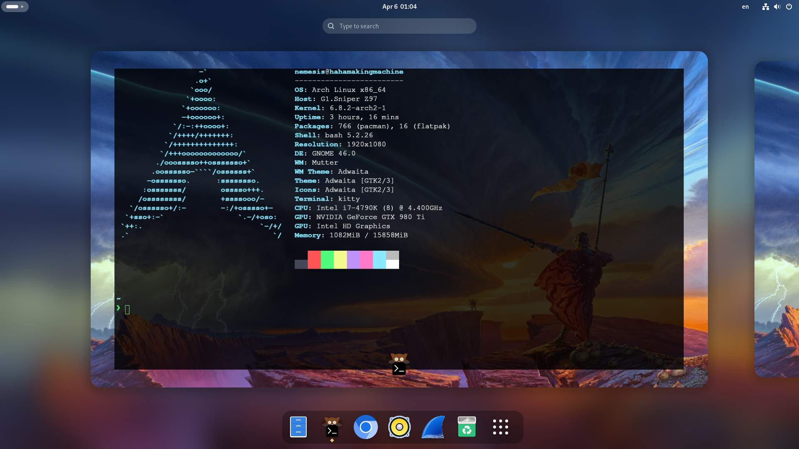
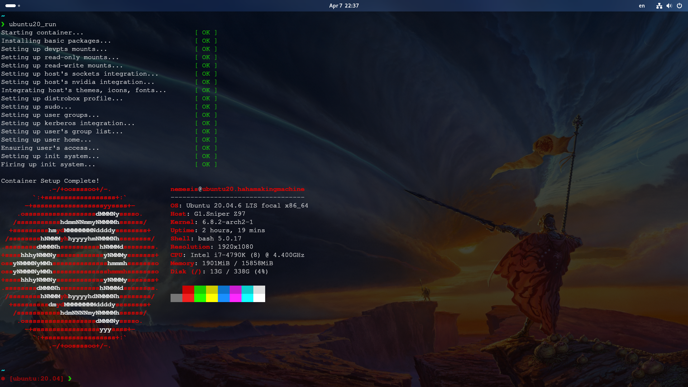
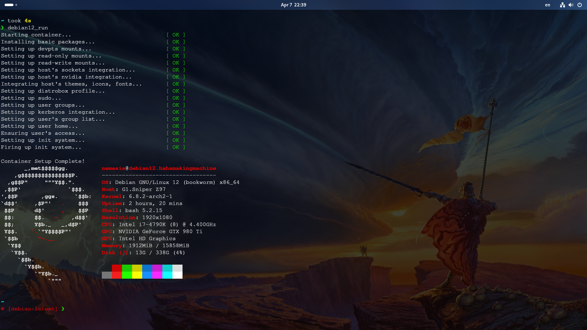

# Arch System ft. GNOME

## Introduction

This is a guide on how to install Arch manually for the fun of it. Then, GNOME will be installed as the desktop environment of choice. Additionally, I will add sections for all extensions/apps I use, so feel free to skip that. Make sure you use ethernet instead of wifi to avoid unnecessary obstacles.

## Prologue: Installation Medium Preparation (Ventoy)
  1. Download arch iso image from their official website.
  2. Either burn it to a flash drive using balena etcher **OR** use Ventoy instead for multi-OS boot from the same drive. \
-- details will be added later


## Book One: Arch Installation

### Chapter One: Pre-pre-requisites


1. Check your internet connection using `ping`

  ```
  ping google.com
  ```

2. Enable network time synchronization

  ```
  timedatectl set-ntp true
  ```


### Chapter Two: Drive Partitioning & Mounting


1. Use `lsblk` to determine which disk to partition and format. In my case, since I disconnected all disks except the one I want to install Arch on, it is `sda`.


2. Use `cfdisk` to begin partitioning:

  ```
  cfdisk /dev/sda
  ```

3. Delete any partitions so that all that remains is free space. Now, create partitions with the following characteristics in the following order:
   1. 2G partition - primary (for `EFI`).
   1. 1G partition - primary (for `boot`---**MAKE SURE TO HIGHLIGHT IT AND PRESS `b` TO MAKE IT BOOTABLE**).
   1. 100G partition - primary (for `root`---I intend on dual booting so I only gave it 100GB to have the rest of the disk as `home` but if you do not intend to do that, just use the rest of the available disk space as `root`).
   1. partition using the remaining space - primary (for `home`---I used a 480GB SSD so I made `home` around 375GB).

4. Exit `cfdisk`. Then format the partitions created above. Make sure to format them all as `ext4` **EXCEPT** for `EFI` partition: it has to be formated as `FAT32` or GRUB will throw random errors at you.

   ```
   # efi
   mkfs.fat -F32 /dev/sda1
   # boot
   mkfs.ext4 /dev/sda2
   # root
   mkfs.ext4 /dev/sda3
   # home
   mkfs.ext4 /dev/sda4
   ```

5. Next step is to mount the partitions:

   ```
   # root
   mount /dev/sda3 /mnt
   # efi
   mkdir -p /mnt/boot/efi
   mount /dev/sda1 /mnt/boot/efi
   # boot
   mount /dev/sda2 /mnt/boot
   # home
   mkdir -p /mnt/home
   mount /dev/sda4 /mnt/home
   ```


### Chapter Three: Install Arch

Now, with your filesystem mounted, simply install Arch along with some essentials. A text editor is needed in the following steps. I chose to install `vim` but feel free to install whatever suits you.

  ```
  pacstrap /mnt base base-devel linux linux-firmware vim
  ```


### Chapter Four: Make an fstab File (This file contains all partitions Arch needs to load on boot)

  ```
  genfstab -U /mnt >> /mnt/etc/fstab
  ```
  The `-U` argument is added to tie the system with the actual drive ID instead of `sda` which might change if drives change.


### Chapter Five: Launch Arch and Setup NM & Grub

1. Launch Arch via the following command:
   
    ```
    arch-chroot /mnt /bin/bash
    ```
2. Use Arch's package manager `pacman` to install `networkmanager` and `grub`:

   ```
   pacman -S networkmanager grub
   ```

3. Configure `systemd` to start `networkmanager` on boot:

   ```
   systemctl enable NetworkManager
   ```

4. Install `grub` on your drive:

   ```
   grub-install /dev/sda
   ```

5. Generate `grub`'s boot config file:

   ```
   grub-mkconfig -o /boot/grub/grub.cfg
   ```
   **NOTE:** If you get a warning message saying: os-prober will not be executed to detect other bootable partitions, open the following file in vim `vim /etc/default/grub` and uncomment the line that says "GRUB_DISABLE_OS_PROPER=false".

### Chapter Six: Adding Finishing Touches

1. There must be a password for the root use. So, set it!

   ```
   passwd
   ```

2. To add locale in order to display/write in English language:

   ```
   #add locale
   vim /etc/locale.gen
   // uncomment "en_US.UTF-8" && "en_US ISO-8859-1"
   #generate locale
   locale-gen
   # define the used language
   vim /etc/locale.conf
   // add the following line:
   LANG=en-US.UTF-8
   ```

3. In order to change the hostname:

   ```
   vim /etc/hostname
   // write the name you want then save and exit
   ```

4. Set your country's time zone. In my case, I used Cairo's configuration. You can look for your country in the `zoneinfo` folder.

   ```
   ln -sf /usr/share/zoneinfo/Africa/Cairo /etc/localtime
   ```

5. The last step is to create a new user, add them to wheel group, set their password, and grant them sudo privilege (the ability to use sudo).

   ```
   # add user to wheel group
   useradd -mg wheel USERNAME
   # set user password
   passwd USERNAME
   # adjust group privilege in sudoers file
   vim /etc/sudoers
   // uncomment the line: %wheel ALL=(ALL:ALL) ALL
   // esc wq! enter
   ```


## Book Two: Installing GNOME (Desktop Environment)

### Chapter One: This is Easier Than I Thought!

1. Update your system and restart.

   ```
   sudo pacman -Syu
   sudo reboot
   ```

2. Install the window manager `Xorg`. Choose all the default options if you do not know what to choose.

   ```
   sudo pacman -S xorg xorg-server
   ```

3. Install GNOME. Choose all the default options if you do not know what to choose.

   ```
   sudo pacman -S gnome
   ```

4. Once GNOME is installed, start `gdm` service:

   ```
   sudo systemctl start gdm.service
   ```

5. Lastly, make sure to run the following command to run `gdm` on startup:

   ```
   sudo systemctl enable gdm.service
   ```


## Book Three: Drip is Unbreakable

### Chapter One: Essential Components to Achieve Drip

1. Install the following packages:

   ```
   sudo pacman -S neofetch kitty flatpak starship
   ```

### Chapter Two: Extensions That Make Drip Achievable! (Extensions of Choice)

1. Go to GNOME app store and download `extension manager`.
2. Search for and install `dash2dock Animated`, `blur my shell`, and `lock screen background`
3. Enable them both and enjoy!


### Chapter Three: That Terminal Looks Gorgous! (Kitty Configuration)

1. Create a configuration file for `kitty`
   ```
   vim ~/.config/kitty/kitty.conf
   ```
   
2. Copy the contents of the `kitty.conf` file in this repository and paste it in your file.


### Chapter Four: Flex That Setup! (neofetch + starship shell prompt)

1. Finally, enter the following lines to enable neofetch and starship:

   ```
   echo "neofetch" >> ~/.bashrc
   echo "eval "$(starship init bash)"" >> ~/.bashrc
   ```

2. Source `.bashrc`.

   ```
   source ~/.bashrc
   ```

3. Open `kitty` and see the results for yourself. :)))


### Chapter Five: Asserting Dominance




## Book Four: Distrobox Setup

### Chapter One: Before Anything

1. Install `docker` and `podman`.
  
  ```
  sudo pacman -S docker podman
  ```

2. Set `docker` and `podman` to run on startup in order to launch system containers at anytime.

  ```
  sudo systemctl enable docker
  sudo systemctl enable podman
  ```

3. Add your user to docker group to get sudo privileges.

  ```
  sudo usermod -aG docker $USER
  ```

4. Install `distrobox`.

  ```
  sudo pacman -S distrobox
  ```

### Chapter Two: Ubuntu 20.04 Container

1. Create a container for Ubuntu 20.04 using the following command. I made sure to include a `--nvidia` argument because I have an Nvidia GPU.

  ```
  distrobox create -n ubuntu20 -i ubuntu:20.04 --init --additional-packages "systemd" --nvidia
  ```

2. In order to open and close the container a bit faster, I created aliases for the long versions of these commands. The two commands below basically copy those aliases to `.bashrc`. DO NOT FORGET TO SOURCE IT AFTER ADDING THEM.

   ```
   echo 'alias ubuntu20_run="distrobox enter ubuntu20"' >> ~/.bashrc
   echo 'alias ubuntu20_stop="distrobox-stop ubuntu20"' >> ~/.bashrc
   source ~/.bashrc
   ```

3. To run it, simply type `ubuntu20_run` in terminal and exit it by typing `exit`. In order to stop it from running in the background, enter `ubuntu20_stop`.

4. Make sure to install both `neofetch` and `starship` to flex that setup:

   ```
   sudo apt update && sudo apt upgrade -y
   sudo apt install neofetch
   sudo curl -sS https://starship.rs/install.sh | sh
   ```

5. Profit!




### Chapter Three: Ubuntu 22.04 Container

1. Create a container for Ubuntu 22.04 using the following command. I made sure to include a `--nvidia` argument because I have an Nvidia GPU.

  ```
  distrobox create -n ubuntu22 -i ubuntu:22.04 --init --additional-packages "systemd" --nvidia
  ```

2. In order to open and close the container a bit faster, I created aliases for the long versions of these commands. The two commands below basically copy those aliases to `.bashrc`. DO NOT FORGET TO SOURCE IT AFTER ADDING THEM.

   ```
   echo 'alias ubuntu_run="distrobox enter ubuntu22"' >> ~/.bashrc
   echo 'alias ubuntu_stop="distrobox-stop ubuntu22"' >> ~/.bashrc
   source ~/.bashrc
   ```

3. To run it, simply type `ubuntu22_run` in terminal and exit it by typing `exit`. In order to stop it from running in the background, enter `ubuntu22_stop`.

4. Make sure to install both `neofetch` and `starship` to flex that setup:

   ```
   sudo apt update && sudo apt upgrade -y
   sudo apt install neofetch
   sudo curl -sS https://starship.rs/install.sh | sh
   ```

5. Profit!


### Chapter Four: Debian 12 Container

1. Create a container for Debian 12 using the following command. I made sure to include a `--nvidia` argument because I have an Nvidia GPU.

  ```
  distrobox create -n debian12 -i debian:latest --init --additional-packages "systemd" --nvidia
  ```

2. In order to open and close the container a bit faster, I created aliases for the long versions of these commands. The two commands below basically copy those aliases to `.bashrc`. DO NOT FORGET TO SOURCE IT AFTER ADDING THEM.

   ```
   echo 'alias debian12_run="distrobox enter debian12"' >> ~/.bashrc
   echo 'alias debian12_run="distrobox-stop debian12"' >> ~/.bashrc
   source ~/.bashrc
   ```

3. To run it, simply type `debian12_run` in terminal and exit it by typing `exit`. In order to stop it from running in the background, enter `debian12_run`.

4. Make sure to install both `neofetch` and `starship` to flex that setup:

   ```
   sudo apt update && sudo apt upgrade -y
   sudo apt install neofetch
   sudo curl -sS https://starship.rs/install.sh | sh
   ```

5. Profit!



### Chapter Five: Fedora 39 Container

1. Create a container for Fedora 39 using the following command. I made sure to include a `--nvidia` argument because I have an Nvidia GPU.

  ```
  distrobox create -n fedora39 -i fedora:39 --init --additional-packages "systemd" --nvidia
  ```

2. In order to open and close the container a bit faster, I created aliases for the long versions of these commands. The two commands below basically copy those aliases to `.bashrc`. DO NOT FORGET TO SOURCE IT AFTER ADDING THEM.

   ```
   echo 'alias fedora39_run="distrobox enter fedora39"' >> ~/.bashrc
   echo 'alias fedora39_stop="distrobox-stop fedora39"' >> ~/.bashrc
   source ~/.bashrc
   ```

3. To run it, simply type `fedora39_run` in terminal and exit it by typing `exit`. In order to stop it from running in the background, enter `fedora39_stop`.

4. Make sure to install both `neofetch` and `starship` to flex that setup:

   ```
   sudo dnf install fedora-upgrade && sudo fedora-upgrade -y
   sudo dnf install neofetch
   sudo curl -sS https://starship.rs/install.sh | sh
   ```

5. Profit!


_That's all folks!_
